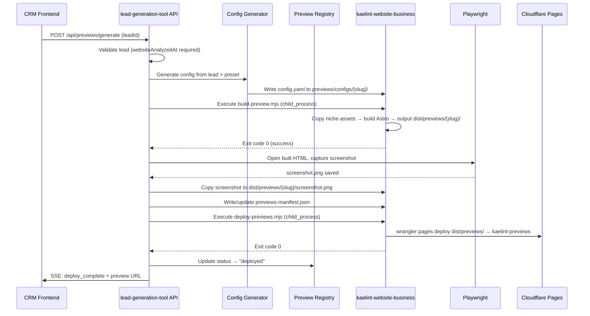
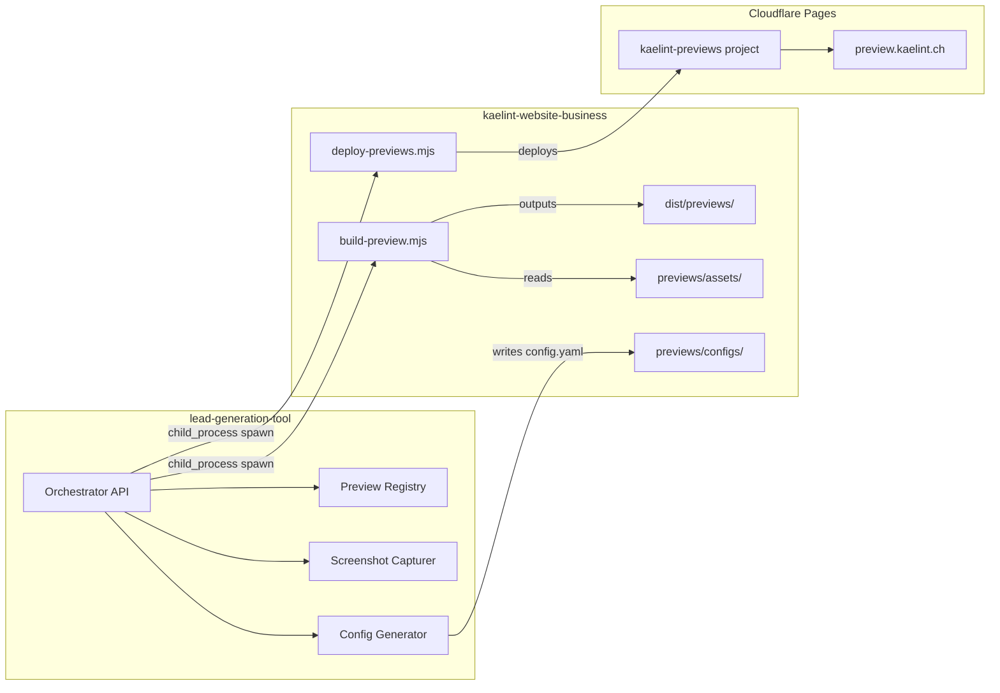
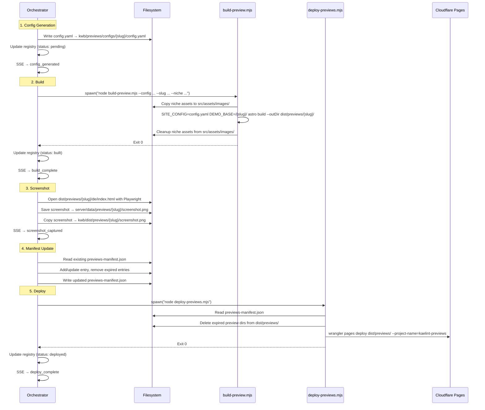

# Design Document: Preview Site Generation

## Overview

This feature automates the generation of personalized demo websites for cold outreach leads. When the operator triggers preview generation from the CRM, the system:

1. Generates a valid `config.yaml` from lead data (using preset maps and niche assets)
2. Builds a static preview site using the kaelint-website-business Astro template
3. Captures a screenshot of the hero section via Playwright
4. Deploys all active previews atomically to Cloudflare Pages at `preview.kaelint.ch/{slug}/`
5. Integrates the preview URL and screenshot into outreach emails

The system spans two repositories:
- **lead-generation-tool** (orchestrator) — config generation, screenshot, registry, API, email integration
- **kaelint-website-business** (builder) — build script, deploy script, niche assets

Communication is via child process execution with CLI arguments. No shared runtime, no network calls between repos.

## Architecture

### High-Level Cross-Repo Data Flow



### Deployment Architecture



## Components and Interfaces

### lead-generation-tool Modules

| Module | Path | Responsibility |
|--------|------|----------------|
| `previewGenerator.js` | `server/lib/previewGenerator.js` | Orchestrates full pipeline, SSE streaming |
| `configGenerator.js` | `server/lib/configGenerator.js` | Maps lead data → config.yaml string |
| `slugGenerator.js` | `server/lib/slugGenerator.js` | Generates URL-safe slugs with UUID prefix |
| `screenshotCapturer.js` | `server/lib/screenshotCapturer.js` | Playwright-based hero screenshot |
| `previewRegistry.js` | `server/lib/previewRegistry.js` | JSON persistence for preview state |
| `previews.js` (route) | `server/routes/previews.js` | Express route handler for `/api/previews/*` |

### kaelint-website-business Modules

| Module | Path | Responsibility |
|--------|------|----------------|
| `build-preview.mjs` | `scripts/build-preview.mjs` | Single preview build (Astro + niche assets) |
| `deploy-previews.mjs` | `scripts/deploy-previews.mjs` | Atomic deploy of all active previews |
| Niche assets | `previews/assets/{niche}/` | Placeholder images per business category |

### Interface Contract (CLI)

```bash
# Build a single preview
node scripts/build-preview.mjs --config <path-to-config.yaml> --slug <slug> --niche <niche>
# Exit 0 = success, non-zero = failure (stderr contains error)

# Deploy all active previews
node scripts/deploy-previews.mjs
# Reads previews/previews-manifest.json for active/expired state
# Exit 0 = success, non-zero = failure
```

### Settings Extension

`settings.json` gains a new field:
```json
{
  "previewSiteRepoPath": "/Users/tabkamac/private/dev/git/kaelint-website-business"
}
```

## Data Models

### Preview Registry (`server/data/previews.json`)

```json
[
  {
    "slug": "a7f3b92e-coiffeur-mueller-bern",
    "leadId": "lead-uuid-123",
    "niche": "coiffeur",
    "createdAt": "2025-06-15T10:30:00.000Z",
    "expiresAt": "2025-07-15T10:30:00.000Z",
    "status": "deployed",
    "screenshotPath": "server/data/previews/a7f3b92e-coiffeur-mueller-bern/screenshot.png",
    "screenshotError": null,
    "previewUrl": "https://preview.kaelint.ch/a7f3b92e-coiffeur-mueller-bern/de/",
    "leadDataHash": "sha256-abc123..."
  }
]
```

**Status transitions:**
```
pending → built → deployed → expired
    ↓        ↓
  failed   failed
```

### Generated Config.yaml Structure

The Config Generator produces a YAML file conforming to the kaelint-website-business Zod schema:

```yaml
businessName: "Coiffeur Müller"
operatorName: "Coiffeur Müller"
contactEmail: "preview@kaelint.ch"
phone: "+41 79 123 45 67"
address:
  street: "Marktgasse 12"
  city: "Bern"
  postalCode: "3011"
siteUrl: "https://preview.kaelint.ch/a7f3b92e-coiffeur-mueller-bern/"
languages: ["de"]
theme: "warm-earth"
primaryColor: "#8B6914"
secondaryColor: "#f3edd9"
accentColor: "#8B6914"
fontFamily: "'DM Serif Display', 'Georgia', serif"
logoPath: "logo.svg"
ctaTarget: "#contactForm"
tagline:
  de: "Ihr Coiffeursalon in Bern"
aboutText:
  de: "Willkommen bei Coiffeur Müller — Ihrem Salon für Schnitt, Farbe und Styling in Bern."
features:
  openingHours: true
  gallery: true
  priceList: true
  contactForm: true
  clickToCall: true
services:
  - name:
      de: "Herrenschnitt"
    description:
      de: "Klassischer oder moderner Schnitt inkl. Waschen und Styling"
  - name:
      de: "Damenschnitt"
    description:
      de: "Schnitt, Waschen und Föhnen"
  - name:
      de: "Färben / Strähnchen"
    description:
      de: "Professionelle Coloration oder Highlights"
openingHours:
  - day: monday
    opens: "09:00"
    closes: "18:00"
  - day: tuesday
    opens: "09:00"
    closes: "18:00"
gallery:
  images:
    - path: "gallery/salon-1.jpg"
      alt: { de: "Salon Impression" }
    - path: "gallery/salon-2.jpg"
      alt: { de: "Salon Impression" }
    - path: "gallery/salon-3.jpg"
      alt: { de: "Salon Impression" }
```

### Previews Manifest (`previews/previews-manifest.json`)

Written by the Orchestrator into the kaelint-website-business repo. Read by `deploy-previews.mjs`.

```json
{
  "previews": [
    {
      "slug": "a7f3b92e-coiffeur-mueller-bern",
      "niche": "coiffeur",
      "createdAt": "2025-06-15T10:30:00.000Z",
      "expiresAt": "2025-07-15T10:30:00.000Z",
      "status": "deployed"
    }
  ],
  "lastUpdated": "2025-06-15T10:35:00.000Z"
}
```

### Preset Map (used by Config Generator)

Extracted from `onboarding/js/presets.js` — the Config Generator uses this data at runtime:

| Niche | Theme | Primary Color | Features |
|-------|-------|--------------|----------|
| coiffeur | warm-earth | #8B6914 | openingHours, gallery, priceList, contactForm, clickToCall |
| restaurant | editorial | #B91C1C | openingHours, gallery, priceList, contactForm, googleMaps |
| therapie | sage-wellness | #4A7C59 | openingHours, scheduling, contactForm, clickToCall |
| handwerk | slate-professional | #1E3A5F | gallery, contactForm, clickToCall, googleMaps |
| einzelhandel | soft-gradient | #6B21A8 | openingHours, priceList, contactForm, googleMaps |
| fitness | ocean-breeze | #0369A1 | openingHours, scheduling, priceList, contactForm |
| kreativ | neon-noir | #E11D48 | gallery, contactForm, clickToCall |
| arztpraxis | nordic-frost | #0F766E | openingHours, scheduling, contactForm, clickToCall |

**Fallback** (unknown category): `slate-professional`, `#475569`, features: `[contactForm, openingHours, clickToCall]`

## Key Algorithms

### Slug Generation

```javascript
function generateSlug(businessName, city) {
  // 1. Generate 8-char UUID prefix
  const prefix = crypto.randomUUID().slice(0, 8);

  // 2. Slugify business name
  let slug = businessName.toLowerCase();
  // Replace umlauts
  slug = slug.replace(/ä/g, 'ae').replace(/ö/g, 'oe').replace(/ü/g, 'ue').replace(/ß/g, 'ss');
  // Remove non-alphanumeric (keep hyphens)
  slug = slug.replace(/[^a-z0-9-]/g, '-');
  // Collapse consecutive hyphens
  slug = slug.replace(/-+/g, '-').replace(/^-|-$/g, '');

  // 3. Slugify and append city
  let citySlug = city.toLowerCase();
  citySlug = citySlug.replace(/ä/g, 'ae').replace(/ö/g, 'oe').replace(/ü/g, 'ue').replace(/ß/g, 'ss');
  citySlug = citySlug.replace(/[^a-z0-9-]/g, '-').replace(/-+/g, '-').replace(/^-|-$/g, '');

  // 4. Combine: {prefix}-{name}-{city}
  let result = `${prefix}-${slug}-${citySlug}`;

  // 5. Truncate to 80 characters
  if (result.length > 80) {
    result = result.slice(0, 80).replace(/-$/, '');
  }

  return result;
}
```

### Color Derivation (mirrors `color-derivation.js`)

```javascript
function deriveColors(primaryHex) {
  const r = parseInt(primaryHex.slice(1, 3), 16);
  const g = parseInt(primaryHex.slice(3, 5), 16);
  const b = parseInt(primaryHex.slice(5, 7), 16);

  // Secondary = 15% primary + 85% white
  const sr = Math.round(r * 0.15 + 255 * 0.85);
  const sg = Math.round(g * 0.15 + 255 * 0.85);
  const sb = Math.round(b * 0.15 + 255 * 0.85);

  const secondary = `#${sr.toString(16).padStart(2, '0')}${sg.toString(16).padStart(2, '0')}${sb.toString(16).padStart(2, '0')}`;
  const accent = primaryHex; // accent = primary

  return { secondary, accent };
}
```

### Config Generation from Lead + Preset

```javascript
function generateConfig(lead, preset, slug) {
  const { secondary, accent } = deriveColors(preset.primaryColor);
  const fontFamily = THEME_FONT_MAP[preset.theme] || "'IBM Plex Sans', sans-serif";

  // Filter features: only enable those that don't require user-specific data
  // Exclude: testimonials, events, faq (require user input)
  const ALLOWED_FEATURES = ['contactForm', 'clickToCall', 'googleMaps', 'scheduling',
    'openingHours', 'gallery', 'priceList', 'services'];
  const enabledFeatures = preset.features.filter(f => ALLOWED_FEATURES.includes(f));

  // Disable clickToCall if no phone
  if (!lead.phone) {
    const idx = enabledFeatures.indexOf('clickToCall');
    if (idx > -1) enabledFeatures.splice(idx, 1);
  }

  return {
    businessName: lead.businessName,
    operatorName: lead.contactPerson || lead.businessName,
    contactEmail: lead.email || 'preview@kaelint.ch',
    phone: lead.phone || '+41 00 000 00 00',
    address: { street: lead.address, city: lead.city, postalCode: '' },
    siteUrl: `https://preview.kaelint.ch/${slug}/`,
    languages: ['de'],
    theme: preset.theme,
    primaryColor: preset.primaryColor,
    secondaryColor: secondary,
    accentColor: accent,
    fontFamily,
    logoPath: 'logo.svg',
    ctaTarget: '#contactForm',
    tagline: { de: generateTagline(lead, preset) },
    aboutText: { de: generateAboutText(lead, preset) },
    features: buildFeatureFlags(enabledFeatures),
    services: preset.services.map(s => ({
      name: { de: s.name },
      description: { de: s.description }
    })),
    openingHours: enabledFeatures.includes('openingHours') ? preset.openingHours : undefined,
    gallery: enabledFeatures.includes('gallery') ? buildGalleryFromNiche(preset.id) : undefined,
  };
}
```

### Expiry Management

- `createdAt`: Set to `new Date().toISOString()` at generation time
- `expiresAt`: `createdAt` + 30 days (`new Date(Date.now() + 30 * 24 * 60 * 60 * 1000)`)
- Deploy script checks `new Date(preview.expiresAt) > new Date()` to include/exclude
- After successful deploy, expired preview directories are deleted from `dist/previews/`
- Registry status updated to `"expired"` by the Orchestrator after deploy confirms removal

### Lead Data Hash (for change detection)

```javascript
const crypto = require('crypto');
function computeLeadDataHash(lead) {
  const data = `${lead.businessName}|${lead.category}|${lead.city || ''}`;
  return crypto.createHash('sha256').update(data).digest('hex').slice(0, 16);
}
```

## API Endpoint Design

### POST `/api/previews/generate`

**Request:**
```json
{ "leadId": "uuid-123" }
```

**Response:** SSE stream (`Content-Type: text/event-stream`)

**SSE Events:**
```
event: progress
data: {"step": "config_generated", "message": "Config generiert"}

event: progress
data: {"step": "build_started", "message": "Build gestartet..."}

event: progress
data: {"step": "build_complete", "message": "Build abgeschlossen"}

event: progress
data: {"step": "screenshot_captured", "message": "Screenshot erstellt"}

event: progress
data: {"step": "deploy_started", "message": "Deploy gestartet..."}

event: complete
data: {"step": "deploy_complete", "previewUrl": "https://preview.kaelint.ch/slug/de/", "screenshotPath": "...", "expiresAt": "..."}

event: error
data: {"step": "build_failed", "message": "Astro build fehlgeschlagen: ..."}
```

**Error cases:**
- 400: Lead not found, lead not analyzed (`websiteAnalyzedAt` missing), missing required fields
- 200 (SSE error event): Pipeline step failure (build, screenshot, deploy)
- 200 (SSE complete, no-op): Existing valid preview with unchanged lead data

### GET `/api/previews/:leadId`

Returns the current preview state for a lead (used by frontend to check existing preview).

```json
{
  "slug": "a7f3b92e-coiffeur-mueller-bern",
  "status": "deployed",
  "previewUrl": "https://preview.kaelint.ch/a7f3b92e-coiffeur-mueller-bern/de/",
  "screenshotPath": "server/data/previews/a7f3b92e-coiffeur-mueller-bern/screenshot.png",
  "expiresAt": "2025-07-15T10:30:00.000Z",
  "createdAt": "2025-06-15T10:30:00.000Z"
}
```

## Build/Deploy Pipeline Sequence



## Error Handling

### Strategy by Pipeline Step

| Step | Failure Mode | Recovery | Registry Status |
|------|-------------|----------|-----------------|
| Config generation | Missing required fields | Return 400, no state change | — |
| Config generation | Unknown category | Fall back to slate-professional | pending (continues) |
| Build | Astro build error / timeout (60s) | Mark failed, stop pipeline | failed |
| Screenshot | Playwright timeout/crash | Log warning, continue without screenshot | built → deployed (screenshotError set) |
| Deploy | Wrangler failure | Mark "built" (preserve artifacts), report error | built |
| Deploy | Manifest read error | Exit with error, report to Orchestrator | built |
| Registry write | Disk error | Retry once, then log + continue | — |

### Atomic Write Pattern

All JSON file writes (registry, manifest) use write-to-temp-then-rename:

```javascript
const tmpPath = targetPath + '.tmp.' + Date.now();
fs.writeFileSync(tmpPath, JSON.stringify(data, null, 2), 'utf-8');
fs.renameSync(tmpPath, targetPath); // atomic on same filesystem
```

### Partial State Prevention

- Config generation: file written only on success (no partial YAML)
- Registry updates: atomic writes ensure no corruption on crash
- Build artifacts: Astro handles cleanup on failure; niche assets cleaned in `finally` block
- Screenshot: captured to temp path, renamed only on success

### Error Messages (Human-Readable, German-Friendly)

```javascript
const ERROR_MESSAGES = {
  LEAD_NOT_FOUND: 'Lead nicht gefunden',
  LEAD_NOT_ANALYZED: 'Website muss zuerst analysiert werden',
  MISSING_BUSINESS_NAME: 'Firmenname fehlt',
  BUILD_FAILED: 'Build fehlgeschlagen',
  BUILD_TIMEOUT: 'Build-Timeout (60s überschritten)',
  DEPLOY_FAILED: 'Deploy fehlgeschlagen',
  PLAYWRIGHT_MISSING: 'Playwright/Chromium nicht installiert. Führe "npx playwright install chromium" aus.',
  SLUG_COLLISION: 'Slug-Kollision nach 3 Versuchen',
};
```

## Testing Strategy

### Unit Tests (Jest — lead-generation-tool)

| Module | Test Coverage |
|--------|--------------|
| `configGenerator.js` | Valid output per niche, fallback for unknown category, field mapping, placeholder emails/phones, Zod compliance, color derivation correctness |
| `slugGenerator.js` | Umlaut replacement, special chars, length truncation, uniqueness retry, format regex |
| `previewRegistry.js` | Create with timestamps, status transitions, expiry calc, atomic writes |
| `previewGenerator.js` | Full pipeline mock (mock child_process, Playwright), SSE event sequence, error handling per step |
| `emailService.js` (extended) | `[Preview-Link]`, `[Preview-Screenshot]`, `[Preview-Ablauf]` placeholders, empty fallbacks |

### Smoke Test (Vitest — kaelint-website-business)

| Script | Test |
|--------|------|
| `build-preview.mjs` | Build from a known-good config, verify output dir structure (`dist/previews/{slug}/de/index.html` exists) |

### Property-Based Tests (fast-check — lead-generation-tool)

See Correctness Properties section below — these cover slug generation invariants, config generation validity, and color derivation correctness.

### Regression

- All existing Jest tests in lead-generation-tool pass unchanged
- All existing vitest/Playwright tests in kaelint-website-business pass unchanged
- `npm run build:demo` continues to work for all demos
- Existing email send flow works for leads without preview data

## Correctness Properties

*A property is a characteristic or behavior that should hold true across all valid executions of a system — essentially, a formal statement about what the system should do. Properties serve as the bridge between human-readable specifications and machine-verifiable correctness guarantees.*

### Property 1: Config Generation produces Zod-valid output

*For any* lead with a non-empty businessName and a recognized or unrecognized category, the Config Generator SHALL produce a YAML string that, when parsed, passes the kaelint-website-business Zod schema validation without errors.

**Validates: Requirements 1.1, 1.3**

### Property 2: Color derivation round-trip consistency

*For any* valid 7-character hex color string, `deriveColors(primary).secondary` SHALL produce a valid hex color where each RGB channel equals `Math.round(channel * 0.15 + 255 * 0.85)`, and the accent SHALL equal the input primary.

**Validates: Requirements 1.5**

### Property 3: Slug format compliance

*For any* business name (containing arbitrary Unicode including umlauts) and any city name, the generated slug SHALL match the regex `^[a-f0-9]{8}-[a-z0-9-]+-[a-z0-9-]+$` and have a total length ≤ 80 characters.

**Validates: Requirements 5.1, 5.2, 5.3, 5.4**

### Property 4: Slug contains no consecutive hyphens

*For any* business name and city combination, the generated slug SHALL NOT contain consecutive hyphens (`--`).

**Validates: Requirements 5.2**

### Property 5: Config Generator fallback always produces valid output

*For any* lead with any arbitrary string as category (including empty, null, numbers, special characters), the Config Generator SHALL produce a valid config using the slate-professional fallback — never throw an unhandled error.

**Validates: Requirements 1.3**

### Property 6: Expiry calculation correctness

*For any* preview creation timestamp, the computed `expiresAt` SHALL be exactly 30 days (30 × 24 × 60 × 60 × 1000 ms) after `createdAt`, and both SHALL be valid ISO 8601 timestamps.

**Validates: Requirements 6.1**

### Property 7: Email placeholder graceful degradation

*For any* lead object (with or without previewUrl, previewScreenshotPath), rendering an email template containing `[Preview-Link]`, `[Preview-Screenshot]`, and `[Preview-Ablauf]` SHALL produce a string without those literal placeholder tokens — they are either replaced with URLs or with empty strings.

**Validates: Requirements 8.1, 8.2, 8.3, 8.4, 8.5**

### Property 8: Features never include user-data-dependent features

*For any* generated config from any niche preset, the enabled features SHALL NOT include `testimonials`, `events`, or `faq` — only features whose data can be auto-generated from presets and niche assets.

**Validates: Requirements 1.9**

